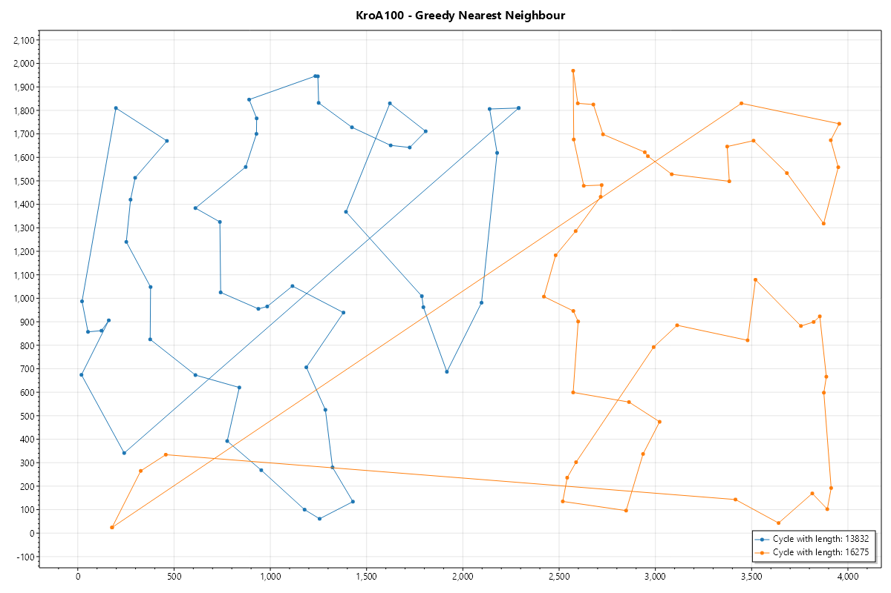

# Laboratorium - Inteligentne metody optymalizacji

## Zadanie 1 - Heurystyki konstrukcyjne

W ramach zadania należało:

- [x] Zaimplementować zapis do obrazu.
- [x] Zaimplementować wczytywanie instancji kroa100 i krob100.
- [x] Zaimplementować algorytm zachłanny inspirowany najbliższego sąsiada.
- [x] Zaimplementować algorytm zachłanny inspirowany metodą rozbudowy cyklu.
- [x] Zaimplementować algorytm zachłanny typu heurestyki z żalem na bazie algorytmu inspirowanego metodą rozbudowy cyklu
  przy wykorzystaniu 2-żal (2-regret).
- [ ] Eksperymenty obliczeniowe na każdej instancji poprzez 100 krotne uruchomienie algorytmu i przedstawienie wyników.

## Implementacja zapisu obrazu.

Obrazy są zapisywane do postaci png za pomocą biblioteki ScottPlot.

- Miejsce zapisu to kotalog `imo-2023/Resources/Graphs/`.
- Odbywa się za pomocą metody `Save` na obiekcie `Plot`.

## Implementacja wczytywania instancji

Wczytywanie instancji odbywa się za pomocą metody `Read` w klasie `Instance`.

- Pliki są odczytywane z katalogu `imo-2023/Resources/Instances/`.
- Wczytywane są tylko współrzędne węzłów.
- Po zaczytaniu pliku, tworzona jest macierz odległości między węzłami służąca do prekalkulacji obliczeń.

## Implementacja algorytmu zachłannego inspirowanego najbliższego sąsiada.

### Pseudokod

- Wybierz losowo lub na podstawie przekazanego indeksu wierzchołek startowy pierwszej ścieżki
- Wybierz wierzchołek najdalszy do pierwszego wierzcholka pierwszej ścieżki
- **powtarzaj**
    - Dodaj do pierwszej ścieżki rozwiązania wierzchołek (i prowadzącą do niego krawędź) najbliższy, który nie jest
      zawarty w pierwszej ani drugiej ścieżce.
    - Dodaj do drugiej ścieżki rozwiązania wierzchołek (i prowadzącą do niego krawędź) najbliższy, który nie jest
      zawarty w pierwszej ani drugiej ścieżce.
- **dopóki** nie zostały dodane wszystkie wierzchołki.
- Dodaj do pierwszej ścieżki krawędź z ostatniego do pierwszego wierzchołka aby utworzyć wynikowy pierwszy cyl.
- Dodaj do drugiej ścieżki krawędź z ostatniego do pierwszego wierzchołka aby utworzyć wynikowy drugi cyl.

### Opis

Poczatkowo są wybierane 2 elementy o skrajnej odległości według prekalkulowanej macierzy odległości.
Następnie dodawane są kolejne elementy, które są najbliżej wybranego elementu.
Dodawanie elementów jest wykonywane dla obu ścieżek w kolejności pierwsza ścieżka, druga ścieżka.
Element najbliższy do ścieżki jest odnajdowany przez najmniejszą wartość odległości do pierwszego lub ostatniego
elementu w macierzy odległości dla elementów nie zawartch w pierwszej ani drugiej ścieżce.
Po wybraniu element jest dodawany do początku lub końca ścieżki na podstawie porównania odległości do pierwszego i
ostatniego elementu w ścieżce. Jeżeli element jest bliższy do pierwszego elementu w ścieżce to jest dodawany na
początek, w przeciwnym wypadku na koniec.
I tak się dzieje do momentu, gdy wszystkie elementy zostaną dodane do ścieżek. Po czym tworzony jest cykl z
ostatnich elementów do pierwszych.

## Eksperyment

Poprzez eksperymenty obliczeniowe chcemy sprawdzić, które z heurystyk konstrukcyjnych odnajduje najlepsze rozwiązanie. W
tym celu zostało wykonane stukrotne uruchomienie każdego z algorytmów na każdej z wybranych instancji ( kroA100,
kroB100 ).

Jako miara jakości rozwiązania wybrano długość ścieżki, która została obliczana poprzez sumę długości między węzłami w
odnalezionym cyklu.

### KroA100

| Algorytm | Długość cyklu A | Długość cyklu B |
|----------|-----------------|-----------------|
|          |                 |                 |
|          |                 |                 |

#### Najlepszy wynik

### KroB100

| Algorytm | Długość cyklu A | Długość cyklu B |
|----------|-----------------|-----------------|
|          |                 |                 |
|          |                 |                 |

#### Najlepszy wynik

